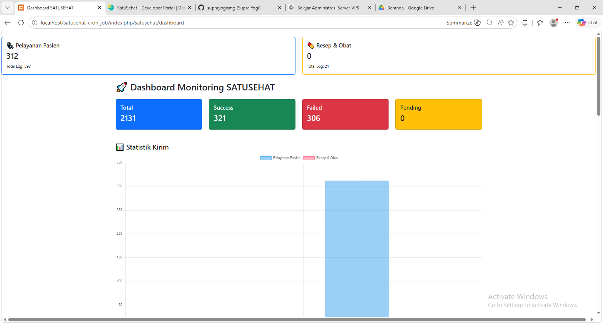
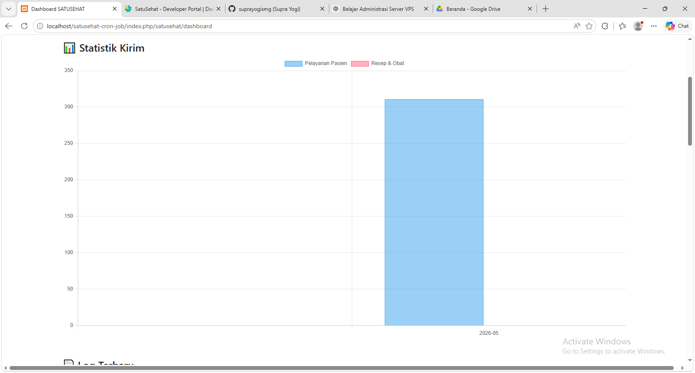
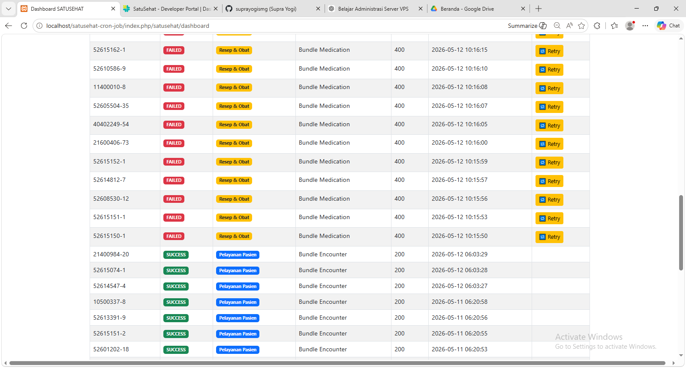

# SATUSEHAT SSP Monitoring Dashboard

## Overview

Monitoring dashboard and automation system for SATUSEHAT SSP resource delivery, including Encounter, Condition, Medication, and MedicationRequest integration workflows.

## Features

- SATUSEHAT SSP Integration
- Encounter Resource Delivery
- Condition Resource Delivery
- Medication Resource Delivery
- MedicationRequest Delivery
- Retry Failed Request
- Monitoring Dashboard
- Success/Failed Tracking
- Delivery Statistics
- Cronjob Automation
- FHIR Resource Logging
  
## Integration Workflow
## Dashboard Monitoring
## Retry Mechanism
## Statistics & Reporting
## SSP Resources
## Screenshots

## Technology Stack
- PHP Native / CodeIgniter
- MySQL
- Bootstrap
- Chart.js
- XAMPP
- Cron Job
- SATUSEHAT API
- FHIR R4
  
## Deployment
## Disclaimer

This repository is intended for portfolio and case study purposes only. Sensitive client data and proprietary business logic have been removed

## Author

Suprayogi
